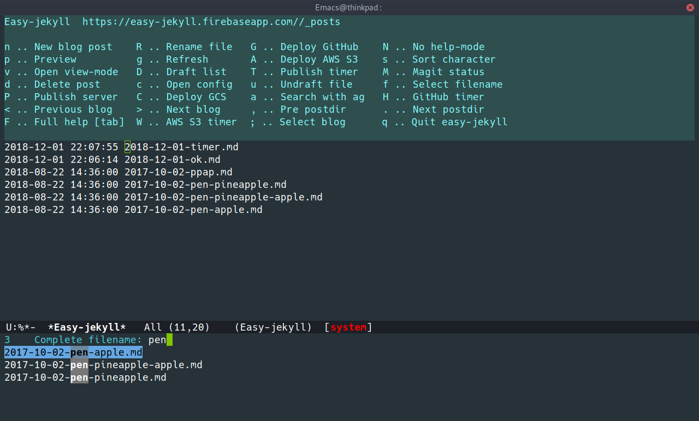
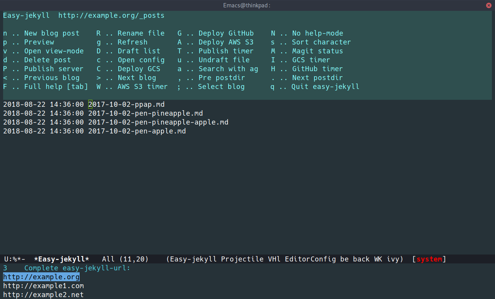

# easy-jekyll [![melpa badge][melpa-badge]][melpa-link] [![melpa stable badge][melpa-stable-badge]][melpa-stable-link] [](https://www.gnu.org/licenses/gpl-3.0)


Emacs major mode for managing jekyll blogs

## Screencast


	M-x easy-jekyll

You can manage blogs on easy-jekyll-mode.
If you manage multiple blogs, you can switch blogs with the < or > key.


    M-x easy-jekyll-newpost

You can post a new article.
Enter a article file name in the minibuffer.
A markdown file is automatically generated.
You can write a blog with [markdown-mode](https://github.com/jrblevin/markdown-mode).


If you enter '.textile' file name in the minibuffer, textile file is automatically generated and you can write a blog with textile.

    M-x easy-jekyll-preview


(The picture of the header is http://www.pixiv.net/member_illust.php?mode=medium&illust_id=60674880)

The browser opens automatically and you can preview the blog on your laptop or desktop.
Even if you run the easy-jekyll-preview command many times, only one jekyll process will run so do not mind it.
Since the process of jekyll running in the laptop or desktop disappears in 300 seconds, you do not have to worry about killing jekyll process.

    M-x easy-jekyll-publish

You can publish your blog to the server and the browser opens automatically.

	M-x easy-jekyll-publish-clever

Clever publish command.
Automatically select the deployment destination from init.el.
If the target blog set easy-jekyll-root, easy-jekyll-publish will be executed.
If the target blog set easy-jekyll-amazon-s3-bucket-name, easy-jekyll-amazon-s3-deploy will be executed.
If the target blog set easy-jekyll-google-cloud-storage-bucket-name, easy-jekyll-google-cloud-storage-deploy be executed.
If the target blog has "deploy.sh" on easy-jekyll-basedir, easy-jekyll-github-deploy will be executed.
If there is firebase command, easy-jekyll-firebase-deploy will be executed.

	M-x easy-jekyll-ag


You can search blog article with [counsel-ag](https://github.com/abo-abo/swiper) or [helm-ag](https://github.com/syohex/emacs-helm-ag).
If both are installed, counsel-ag takes precedence at default and
you can use helm-ag by writing the following to .emacs or init.el.

	(setq easy-jekyll-helm-ag t)

If you deploy your blog at [Firebase](https://firebase.google.com/).

	M-x easy-jekyll-firebase-deploy

To use easy-jekyll-firebase-deploy, you make project at firebase hosting using your browser.
Next run command.

    npm install -g firebase-tools
	cd [your-jekyll-directory]
	firebase login
	firebase init
	firebase deploy

If you deploy your blog at github.

	M-x easy-jekyll-github-deploy

Execute deploy.sh which exists in directory `easy-jekyll-basedir`.
It is useful for hosting on [GitHub Pages](https://help.github.com/articles/using-jekyll-as-a-static-site-generator-with-github-pages/) etc.
If you use the rake task in deploy.sh, please refer to [here](https://github.com/masasam/emacs-easy-jekyll/issues/3).

Example of deploy.sh

	#!/bin/bash
	git checkout gh-pages
	git add -A
	git commit -m "Update blog"
	git push origin gh-pages

Don't forget granting execute permission to deploy.sh.

Below is how to pass password to deploy.sh.
You are to set up connecting to GitHub with SSH (see https://help.github.com/articles/connecting-to-github-with-ssh/).
You install keychain (see http://www.funtoo.org/Keychain).
Now that you don't need a password, you can run deploy.sh.

Example of deploy.sh for netlify

	npm install netlify-cli -g
	netlify login
	netlify init

```bash
#!/bin/bash

rm -rf _site
bundle exec jekyll build --destination _site
cd _site

expect -c "
set timeout 100
spawn env LANG=C netlify deploy --prod
expect \"(.)\"
send \"\n\"
expect \"$\"
exit 0
"
```

	M-x easy-jekyll-amazon-s3-deploy

Deploy jekyll source at Amazon S3.

	M-x easy-jekyll-google-cloud-storage-deploy

Deploy jekyll source at Google Cloud Storage.

	M-x easy-jekyll-next-postdir
	M-x easy-jekyll-previous-postdir

With this you can go to a directory other than _post.

	M-x easy-jekyll-nth-blog

You can move to a blog with the specified number.

	M-x easy-jekyll-select-filename

Select filename you want to open. You can open a selected filename article.



	M-x easy-jekyll-select-postdir

Select postdir you want to go. You can go to a selected directory.


	M-x easy-jekyll-select-blog

Select blog you want to go. You can go to a selected blog.



	M-x easy-jekyll-image

Generate link of image from image file directory under 'easy-jekyll-image-directory' directory.
'easy-jekyll-image-directory' default is 'images'.


When you select the image file you want to use, a link will be inserted.
The default for the image file directory name is "images", but if you want to change it, write as follows.

	(setq easy-jekyll-image-directory "img")


	M-x easy-jekyll-put-image

Move image to 'easy-jekyll-image-directory' and generate image link.
You can change the initial launch position with 'easy-jekyll-default-picture-directory'.


	M-x easy-jekyll-pull-image

Pull image from internet to image directory and generate image link.
Copy the URL of the image you want to download with your browser.
Execute M-x easy-jekyll-pull-image.


Decide file name.
If you press enter without deciding the file name, the file name can be used as it is.


The file is saved in 'easy-jekyll-image-directory' and generate image link.


## Commands for easy-jekyll-mode

|key    |function      |
|-------|--------------|
|RET	|easy-jekyll-open|
|Tab	|easy-jekyll-full-help|
|Shift-Tab|easy-jekyll-no-help|
|SPC	|easy-jekyll-next-line|
|Shift-SPC|easy-jekyll-previous-line|
|←	    |easy-jekyll-backward-char|
|→      |easy-jekyll-forward-char|
|C-b	|easy-jekyll-backward-char|
|C-f	|easy-jekyll-forward-char|
|C-n	|easy-jekyll-next-line|
|C-p	|easy-jekyll-previous-line|
|M-b	|easy-jekyll-backward-word|
|M-<	|easy-jekyll-beginning-of-buffer|
|.      |easy-jekyll-next-postdir|
|,      |easy-jekyll-previous-postdir|
|+      |easy-jekyll-next-postdir|
|-      |easy-jekyll-previous-postdir|
|/      |easy-jekyll-select-postdir|
|;      |easy-jekyll-select-blog|
|<		|easy-jekyll-previous-blog|
|>		|easy-jekyll-next-blog|
|?		|describe-mode|
|!		|easy-jekyll-cansel-firebase-deploy-timer|
|A		|easy-jekyll-amazon-s3-deploy|
|B		|easy-jekyll-firebase-deploy|
|C		|easy-jekyll-google-cloud-storage-deploy|
|D		|easy-jekyll-list-draft|
|F		|easy-jekyll-full-help|
|G		|easy-jekyll-github-deploy|
|H		|easy-jekyll-github-deploy-timer|
|I		|easy-jekyll-google-cloud-storage-deploy-timer|
|J		|easy-jekyll-nth-blog|
|L		|easy-jekyll-firebase-deploy-timer|
|M		|easy-jekyll-magit|
|N		|easy-jekyll-no-help|
|O		|easy-jekyll-open-basedir|
|P		|easy-jekyll-publish-clever|
|R		|easy-jekyll-rename|
|S		|easy-jekyll-sort-time|
|T		|easy-jekyll-publish-timer|
|V		|easy-jekyll-view-other-window|
|W		|easy-jekyll-amazon-s3-deploy-timer|
|a		|easy-jekyll-ag|
|b		|easy-jekyll-cancel-github-deploy-timer|
|c		|easy-jekyll-open-config|
|d		|easy-jekyll-delete|
|e      |easy-jekyll-open|
|f		|easy-jekyll-select-filename|
|g		|easy-jekyll-refresh|
|h		|easy-jekyll-backward-char|
|i		|easy-jekyll-cancel-google-cloud-storage-deploy-timer|
|j		|easy-jekyll-next-line|
|k		|easy-jekyll-previous-line|
|l		|easy-jekyll-forward-char|
|m		|easy-jekyll-cancel-amazon-s3-deploy-timer|
|n		|easy-jekyll-newpost|
|o		|easy-jekyll-open-other-window|
|p		|easy-jekyll-preview|
|q		|easy-jekyll-quit|
|r		|easy-jekyll-refresh|
|s		|easy-jekyll-sort-char|
|t		|easy-jekyll-cancel-publish-timer|
|u		|easy-jekyll-undraft|
|v		|easy-jekyll-view|
|w		|easy-jekyll-newpost|

## Requirements

- Emacs 25.1 or higher
- jekyll 3.5.1 or higher

## Installation

You can install `easy-jekyll.el` from [MELPA](http://melpa.org) with package.el
(`M-x package-install easy-jekyll`).
Confirm that PATH passes from emacs to jekyll.
I recommend you are going to install [exec-path-from-shell]( https://github.com/purcell/exec-path-from-shell).
I recommend you are going to install [keychain-environment](https://github.com/tarsius/keychain-environment).
Easy-jekyll-ag needs [the_silver_searcher](https://github.com/ggreer/the_silver_searcher).
Easy-jekyll-ag needs [counsel-ag](https://github.com/abo-abo/swiper) or [helm-ag](https://github.com/syohex/emacs-helm-ag).

## Sample Configuration

When you change setting, you need to restart emacs.

If you deploy your blog at your server.

	(setq easy-jekyll-basedir "~/my-awesome-site/")
	(setq easy-jekyll-url "https://yourblogdomain")
	(setq easy-jekyll-sshdomain "blogdomain")
	(setq easy-jekyll-root "/home/blog/")
	(setq easy-jekyll-previewtime "300")
	(define-key global-map (kbd "C-c C-e") 'easy-jekyll)

If you use [use-package](https://github.com/jwiegley/use-package), please write them all in :init.

	(use-package easy-jekyll
	:init
	(setq easy-jekyll-basedir "~/my-awesome-site/")
	(setq easy-jekyll-url "https://yourblogdomain")
	(setq easy-jekyll-sshdomain "blogdomain")
	(setq easy-jekyll-root "/home/blog/")
	(setq easy-jekyll-previewtime "300")
	:bind ("C-c C-e" . easy-jekyll))

If you deploy your blog at amazon s3.

	(setq easy-jekyll-basedir "~/bookshelf/")
	(setq easy-jekyll-url "https://yourblogdomain")
	(setq easy-jekyll-amazon-s3-bucket-name "yourS3bucketname")

If you deploy your blog at google cloud strage.

	(setq easy-jekyll-basedir "~/bookshelf/")
	(setq easy-jekyll-url "https://yourblogdomain")
	(setq easy-jekyll-google-cloud-storage-bucket-name "yourGCPbucketname")

If you deploy your blog at github pages etc.

	(setq easy-jekyll-basedir "~/bookshelf/")
	(setq easy-jekyll-url "https://yourid.github.io"))

If you deploy your blog at firebase hosting.

	(setq easy-jekyll-basedir "~/bookshelf/")
	(setq easy-jekyll-url "https://yourproject.firebaseapp.com")

|name    |description      |
|-------|--------------|
|easy-jekyll-basedir | Directory where jekyll html source code is placed on your laptop or desktop|
|easy-jekyll-url |Url of the blog|
|easy-jekyll-sshdomain |Domain written in ~/.ssh/config|
|easy-jekyll-root |Root directory of jekyll at your server|
|easy-jekyll-previewtime |Preview display time|

If you want to deploy jekyll at Amazon S3, please install AWS CLI and set easy-jekyll-amazon-s3-bucket-name.
Please set up for with `aws configure` command if you are the first time aws command.

	(setq easy-jekyll-amazon-s3-bucket-name "your-amazon-s3-bucket-name")

If you want to deploy jekyll at Google Cloud Storage, please install Google Cloud SDK and set easy-jekyll-google-cloud-storage-bucket-name.
Please set up for with `gcloud auth login` command if you are the first time gcloud command.

	(setq easy-jekyll-google-cloud-storage-bucket-name "your-google-cloud-storage-bucket-name")

If you want the default extension to be '.textile'.
If not set the default extension will be '.md'.

	(setq easy-jekyll-default-ext ".textile")

If you want to change to No help-mode from startup.

	(setq easy-jekyll-no-help t)

If you want to set sort time at s key.
If not set the default s key will be charactor-sort.

	(setq easy-jekyll-sort-default-char nil)

If you want to customise color, write the following in the init.el or .emacs.

	(defface easy-jekyll-help-face
	'((((class color) (background light)) (:bold t :foreground "your-hex-color" :background "your-hex-color"))
    (((class color) (background dark)) (:bold t :foreground "your-hex-color" :background "your-hex-color")))
	""
	:group 'easy-jekyll-faces)

In order to generate link of image from image file directory under 'easy-jekyll-image-directory' directory,
if you want to change image file directory.
If not set the default image file directory will be 'images'.

	(setq easy-jekyll-image-directory "img")

Setting the picture directory of your laptop or desktop, it is easy to execute M-x easy-jekyll-put-image.

	(setq easy-jekyll-default-picture-directory "~/Pictures")

## Multiple blogs setting

When you change setting, you need to restart emacs.

	;; Main blog
	(setq easy-jekyll-basedir "~/my-awesome-site/")
	(setq easy-jekyll-url "https://yourblogdomain")
	(setq easy-jekyll-sshdomain "blogdomain")
	(setq easy-jekyll-root "/home/blog/")
	(setq easy-jekyll-previewtime "300")
	(define-key global-map (kbd "C-c C-e") 'easy-jekyll)

	(setq easy-jekyll-bloglist
		;; blog2 setting
		'(((easy-jekyll-basedir . "~/src/github.com/masasam/jekyll2/")
		(easy-jekyll-url . "http://example2.com")
		(easy-jekyll-sshdomain . "myblogdomain")
		(easy-jekyll-root . "/home/jekyll/"))
		;; blog3 setting for aws s3
		((easy-jekyll-basedir . "~/src/github.com/masasam/jekyll3/")
		(easy-jekyll-url . "http://example3.net")
		(easy-jekyll-amazon-s3-bucket-name . "yourS3bucketname"))
		;; blog4 setting for google cloud storage
		((easy-jekyll-basedir . "~/src/github.com/masasam/jekyll4/")
		(easy-jekyll-url . "http://example4.net")
		(easy-jekyll-google-cloud-storage-bucket-name . "yourGCPbucketname")
		(easy-jekyll-image-directory . "img"))
		;; blog5 for github pages
		((easy-jekyll-basedir . "~/src/github.com/masasam/githubpages/")
		(easy-jekyll-url . "https://yourid.github.io"))
		;; blog6 for firebase hosting
		((easy-jekyll-basedir . "~/src/github.com/masasam/firebase/")
		(easy-jekyll-url . "https://yourproject.firebaseapp.com"))))

If you use [use-package](https://github.com/jwiegley/use-package), please write them all in :init.

	(use-package easy-jekyll
	:init
	;; Main blog
	(setq easy-jekyll-basedir "~/my-awesome-site/")
	(setq easy-jekyll-url "https://yourblogdomain")
	(setq easy-jekyll-sshdomain "blogdomain")
	(setq easy-jekyll-root "/home/blog/")
	(setq easy-jekyll-previewtime "300")
	(define-key global-map (kbd "C-c C-e") 'easy-jekyll)

	(setq easy-jekyll-bloglist
		;; blog2 setting
		'(((easy-jekyll-basedir . "~/src/github.com/masasam/jekyll2/")
		(easy-jekyll-url . "http://example2.com")
		(easy-jekyll-sshdomain . "myblogdomain")
		(easy-jekyll-root . "/home/jekyll/"))
		;; blog3 setting for aws s3
		((easy-jekyll-basedir . "~/src/github.com/masasam/jekyll3/")
		(easy-jekyll-url . "http://example3.net")
		(easy-jekyll-amazon-s3-bucket-name . "yourS3bucketname"))
		;; blog4 setting for google cloud storage
		((easy-jekyll-basedir . "~/src/github.com/masasam/jekyll4/")
		(easy-jekyll-url . "http://example4.net")
		(easy-jekyll-google-cloud-storage-bucket-name . "yourGCPbucketname")
		(easy-jekyll-image-directory . "img"))
		;; blog5 for github pages
		((easy-jekyll-basedir . "~/src/github.com/masasam/githubpages/")
		(easy-jekyll-url . "https://yourid.github.io"))
		;; blog6 for firebase hosting
		((easy-jekyll-basedir . "~/src/github.com/masasam/firebase/")
		(easy-jekyll-url . "https://yourproject.firebaseapp.com"))))
	:bind ("C-c C-e" . easy-jekyll))

You can manage as many blogs as you like.

If you want to change markdown filename extension, please select markdown.
Because only markdown is supported by jekyll. If not set markdown filename extension will be 'md'.

	(setq easy-jekyll-markdown-extension "markdown")

## For spacemacs or evil-mode users example

If you use [spacemacs](https://github.com/syl20bnr/spacemacs) or [evil-mode](https://github.com/emacs-evil/evil).

	(defun cesco/easy-jekyll ()
	(interactive)
	(evil-define-key
    (list 'normal 'insert 'visual 'motion)
    easy-jekyll-mode-map
    "n" 'easy-jekyll-newpost
    "D" 'easy-jekyll-article
    "p" 'easy-jekyll-preview
    "P" 'easy-jekyll-publish
    "o" 'easy-jekyll-open
    "d" 'easy-jekyll-delete
    "e" 'easy-jekyll-open
    "c" 'easy-jekyll-open-config
    "f" 'easy-jekyll-open
    "N" 'easy-jekyll-no-help
    "v" 'easy-jekyll-view
    "r" 'easy-jekyll-refresh
    "g" 'easy-jekyll-refresh
    "s" 'easy-jekyll-sort-time
    "S" 'easy-jekyll-sort-char
    "G" 'easy-jekyll-github-deploy
    "A" 'easy-jekyll-amazon-s3-deploy
    "C" 'easy-jekyll-google-cloud-storage-deploy
    "q" 'evil-delete-buffer
    (kbd "TAB") 'easy-jekyll-open
    (kbd "RET") 'easy-jekyll-preview)
	(define-key global-map (kbd "C-c C-e") 'easy/jekyll))

	(use-package easy-jekyll
	:after (helm-ag)
	:ensure t
	:config
	(setq easy-jekyll-basedir "~/go/src/github.com/cescoferraro/me/"
	easy-jekyll-postdir "content/blog"
        easy-jekyll-url "http://127.0.0.1:1313/me"
        easy-jekyll-preview-url "http://127.0.0.1:1313/me"
        easy-jekyll-sshdomain "me"
        easy-jekyll-root "~/go/src/github.com/cescoferraro/me/"
        easy-jekyll-previewtime "20")
	(add-hook 'easy-jekyll-mode-hook 'cesco/easy-jekyll))

## Preparation for using this package

Install jekyll and bundler

	gem install jekyll bundler
	jekyll new my-awesome-site
	cd my-awesome-site
	bundle install --path vendor/bundle

See https://jekyllrb.com/

### Configuration file example

_config.yml

	title: PPAP-blog
	email: picotaro@example.com
	description: > # this means to ignore newlines until "baseurl:"
	baseurl: "" # the subpath of your site, e.g. /blog
	url: "" # the base hostname & protocol for your site, e.g. http://example.com
	twitter_username: jekyllrb
	github_username:  jekyll
	markdown: kramdown
	theme: minima
	plugins:
	- jekyll-feed

### Prepare the server

Let's build with a free trial of "google compute engine" or "amazon ec2".
If you want to deploy jekyll at GitHub Pages or Amazon S3 or Google Cloud Storage, This paragraph is not necessary.
I created my blog in google compute engine.
Check if rsync is installed on the server.

Write at ~/.ssh/config on your laptop or desktop.

	 Host blogdomain
                        HostName "Your server's IP"
                        User "Your server's ssh login username"

Because blog is generated under /home/blog/ on the server, set it to reference it with nginx.
SSL uses certbot (Let's encrypt).

sample nginx.conf

	server {
		listen 80;
		server_name yourdomain;
		return  301 https://yourdomain$request_uri;
		location / {
			root /home/blog;
		index	index.html index.htm;
		}
	}
	server {
		listen 443;
		server_name yourdomain;
		ssl on;
		ssl_certificate      /etc/letsencrypt/live/yourdomain/fullchain.pem;
		ssl_certificate_key  /etc/letsencrypt/live/yourdomain/privkey.pem;

	location / {
		root    /home/blog;
	index   index.html index.htm;
		}
	}

PPAP blog source code sample for jekyll.

https://github.com/masasam/PPAP2

[melpa-link]: http://melpa.org/#/easy-jekyll
[melpa-badge]: http://melpa.org/packages/easy-jekyll-badge.svg
[melpa-stable-link]: http://stable.melpa.org/#/easy-jekyll
[melpa-stable-badge]: http://stable.melpa.org/packages/easy-jekyll-badge.svg
